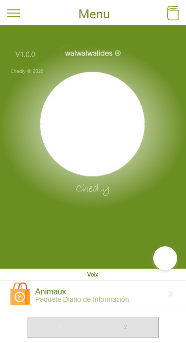

# Chedly_Desktop

`Chedly` is a complete Software Solution for Management Animal vocalization.

**Authors:**  *WalWalWalides*
------

The Software offers a new Way for better Management Animal vocalization. That means granting increased Productivity - That promises more and better Work in less Time.

`Chedly` simplifies service Storing and Organization, enables optimal Staffing,and you can use with different ways.

Principal Software Benefits:

      - Send and Receive Data from app

      - Flexible and Powerful User Interface.

      - Efficient Packages and resource Planning,storing.

      - Strong resource Management and capacity Planning.
      
      - Backup and Recovery.

    
    

## Contains

| Module | Name | 
| --- | --- |
|ChedlyQuiz.exe|Management Animal vocalization|

------

## To Install the Software:

### Install application 

Download Link For Chedly : https://github.com/walwalwalides/Chedly/releases/download/V1.0.0/Chedly__Setup.exe

------
### Demo
How to read sounds 
[Youtub Video] : https://www.youtube.com/watch?v=K8vEqX5kNs8
# If You Want To Donate!

